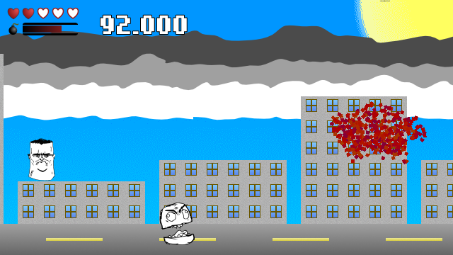

# Shoot Em Dead

A project I did to get the hang of the [Godot](https://godotengine.org/) engine. Works with Godot 3.2.

## Just Developer Things

Are you a connoisseur of fine code? The `lib` folder contains code intended to be reused in other projects. This includes:

* GUI stuff, such as `ProgressTiles` and `Slideshow`.
* A stack-based state machine. Everyone seems to have one, so here’s mine.

## Credits

### Graphics

* The font _MatchupPro_ is part of the [_Humble Fonts Free_](https://somepx.itch.io/humble-fonts-free) font pack by [Eeve Somepx](https://somepx.itch.io).
* Godot Logo (C) Andrea Calabró. Distributed under the terms of the [Creative Commons Attribution License version 3.0 (CC-BY 3.0)](https://creativecommons.org/licenses/by/3.0/legalcode).

### Music

* Menu music based on _False Awakenings_ by [Anders](https://soundcloud.com/anttu-janhunen/false-awakenings). Distributed under the terms of the [Creative Commons Attribution-NonCommercial-ShareAlike 3.0 Unported license (CC BY-NC-SA 3.0)](https://creativecommons.org/licenses/by-nc-sa/3.0/).
* Gameplay music based on _Local Forecast - Slower_ by [Kevin MacLeod](https://incompetech.filmmusic.io/song/3988-local-forecast-slower/). Distributed under the terms of the [Creative Commons Attribution License version 4.0 (CC-BY 4.0)](http://creativecommons.org/licenses/by/4.0/).

### Sounds

* Menu sounds by [S_Dij](https://freesound.org/people/S_Dij/sounds/88288/). Distributed under the terms of the [Attribution 3.0 Unported (CC BY 3.0)](http://creativecommons.org/licenses/by/3.0/) license.
* Game intro sound by [wjl](https://freesound.org/people/wjl/sounds/267887/). Disitrubed under the terms of the [CC0 1.0 Universal (CC0 1.0) Public Domain Dedication](https://creativecommons.org/publicdomain/zero/1.0/).
* Gunshot sounds by [qubodup](https://freesound.org/people/qubodup/sounds/187677/). Distributed under the terms of the [Creative Commons 0 License (CC0 1.0)](http://creativecommons.org/publicdomain/zero/1.0/).
* Bomb ready sound by [MATTIX](https://freesound.org/people/MATTIX/sounds/503608/). Distributed under the terms of the [Attribution 3.0 Unported (CC BY 3.0) license](https://creativecommons.org/licenses/by/3.0/).
* Explosion sound by [tommccann](https://freesound.org/people/tommccann/sounds/235968/). Distributed under the terms of the [CC0 1.0 Universal (CC0 1.0) Public Domain Dedication](https://creativecommons.org/publicdomain/zero/1.0/).
* Wilhelm scream likely by Sheb Wooley, but in the public domain. Downloaded from [Wikimedia Commons](https://commons.wikimedia.org/wiki/File:Wilhelm_Scream.ogg).
